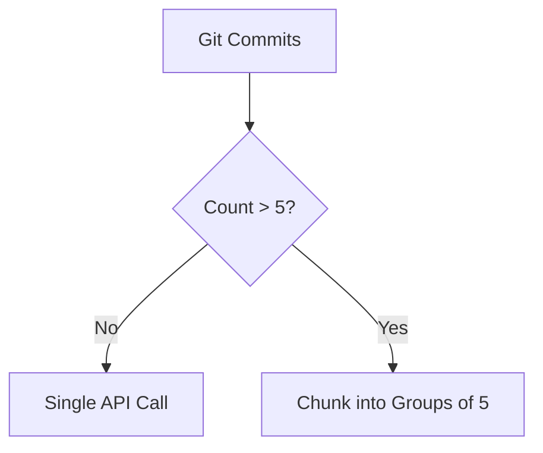

<objective>
Create architecture documentation with Mermaid diagrams showing the chunking strategy and data flow.

Purpose: Visual architecture diagrams help users understand the action's processing strategy (micro-chunking for quality), aid contributors in understanding the codebase, and demonstrate professional documentation standards for portfolio quality.

Output: docs/ARCHITECTURE.md with detailed Mermaid diagrams
</objective>

<execution_context>
@/Users/robertfridzema/.claude/get-shit-done/workflows/execute-plan.md
@/Users/robertfridzema/.claude/get-shit-done/templates/summary.md
</execution_context>

<context>
@.planning/PROJECT.md
@.planning/ROADMAP.md
@.planning/STATE.md
@.planning/phases/05-documentation-polish/05-RESEARCH.md

# Source code to document:
@src/generate_changelog.py
@CLAUDE.md
</context>

<tasks>

<task type="auto">
  <name>Task 1: Create docs/ARCHITECTURE.md with detailed architecture diagrams</name>
  <files>docs/ARCHITECTURE.md</files>
  <action>
Create docs/ARCHITECTURE.md with comprehensive architecture documentation including Mermaid diagrams.

First, ensure docs/ directory exists: `mkdir -p docs`

Structure the document with these sections:

## 1. Overview
Brief description of the action's purpose and approach.

## 2. High-Level Flow Diagram
Simple flowchart (8-10 nodes) showing the main processing stages:
- Input validation
- Commit collection
- Chunking decision (>5 commits?)
- AI processing
- Changelog output

Use `flowchart TD` (top-down) for this diagram.

## 3. Micro-Chunking Strategy
Detailed diagram showing the chunking approach:
- Commits split into chunks of 5
- Each chunk processed for technical + business summaries
- Chunk summaries merged via AI
- Final changelog generated

Key thresholds to document:
- COMMITS_PER_CHUNK = 5
- Separate API calls for technical and business summaries
- Retry logic with exponential backoff

## 4. Data Flow Diagram
Show what data flows through each stage:
- Git commits -> Commit parser -> Commit objects
- Commit objects -> Chunker -> Chunk batches
- Chunks -> OpenRouter API -> Summaries
- Summaries -> Merger -> Final content
- Final content -> Changelog formatter -> CHANGELOG.md

## 5. Extended Mode
Document the additional processing when `extended: true`:
- File change statistics collection
- Detailed numstat data
- Additional token allocation (6000 vs 3000)

## 6. Error Handling
Document retry strategy:
- 3 attempts with exponential backoff
- Jitter to prevent thundering herd
- 429 rate limiting detection
- Fallback summaries on failure

Use proper Mermaid syntax:
- `flowchart TD` for vertical flows
- `flowchart LR` for horizontal flows
- Diamonds `{decision}` for conditionals
- Subgraphs for grouping related steps
- Clear labels on all arrows

Example Mermaid patterns from research:

  </action>
  <verify>
Directory exists: `ls -d docs/`
File exists: `ls docs/ARCHITECTURE.md`
Contains Mermaid: `grep -c '\`\`\`mermaid' docs/ARCHITECTURE.md` should return 3 or more
Documents chunking: `grep -q 'chunk' docs/ARCHITECTURE.md`
Documents threshold: `grep -q '5' docs/ARCHITECTURE.md`
  </verify>
  <done>docs/ARCHITECTURE.md exists with at least 3 Mermaid diagrams documenting the chunking strategy and data flow</done>
</task>

</tasks>

<verification>
All verification commands should pass:

```bash
# Directory and file exist
ls -d docs/
ls docs/ARCHITECTURE.md

# Contains multiple Mermaid diagrams (at least 3)
[ $(grep -c '```mermaid' docs/ARCHITECTURE.md) -ge 3 ]

# Documents key concepts
grep -q 'chunk' docs/ARCHITECTURE.md
grep -q -i 'micro.chunk\|COMMITS_PER_CHUNK\|groups of 5' docs/ARCHITECTURE.md
grep -q 'OpenRouter\|API' docs/ARCHITECTURE.md
grep -q 'retry\|backoff' docs/ARCHITECTURE.md

# Mermaid syntax is valid (flowchart declarations exist)
grep -q 'flowchart' docs/ARCHITECTURE.md
```
</verification>

<success_criteria>
1. docs/ARCHITECTURE.md exists with comprehensive architecture documentation
2. Contains at least 3 Mermaid diagrams (high-level flow, chunking strategy, data flow)
3. Documents the micro-chunking approach (5 commits per chunk threshold)
4. Documents retry strategy and error handling
5. Documents extended mode differences
6. Uses valid Mermaid syntax that will render on GitHub
</success_criteria>

<output>
After completion, create `.planning/phases/05-documentation-polish/05-02-SUMMARY.md`
</output>
