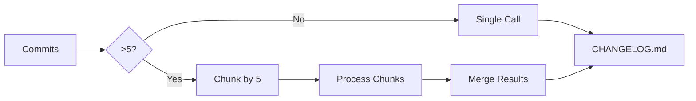

# Phase 5 Plan 03: README Restructure and Polish Summary

**One-liner:** Professional README restructure with MIT badge, optimized section order, enhanced troubleshooting, and architecture overview linking to detailed documentation.

## What Was Delivered

Restructured README.md for professional presentation and optimal user experience:

### 1. Badge Enhancement
- Added MIT License badge alongside existing CI badge
- Dual badges establish credibility (CI shows quality, License shows openness)

### 2. Section Reorganization
Implemented research-recommended order for GitHub Actions:
- **Badges** (first visual element)
- **Title + One-line** (immediate understanding)
- **Features** (value proposition)
- **Quick Start** (moved from line 100 to line 16 - users get working example in <30 seconds)
- **Prerequisites** (API key setup before detailed examples)
- **Usage Examples** (simple → advanced progression)
- **Common Mistakes** (preventive guidance)
- **Action Inputs** (reference table)
- **Troubleshooting** (problem resolution)
- **Architecture** (technical context)
- **Security** (link to policy)
- **Contributing** (link to CoC)
- **License** (legal)

### 3. Enhanced Troubleshooting Section
Added comprehensive troubleshooting following best-practice structure:

**Symptoms of Incomplete Changelog**
- Observable indicators users experience first
- 4 specific symptoms listed

**Root Causes**
- Insufficient Git fetch depth (with version context)
- Very high commit volume scenarios
- Actionable explanations

**Solutions**
- Verification steps (check logs, CHANGELOG indicators, commit counts)
- Authentication issues (401/403) → API key validation steps
- Model availability (404) → Alternative model suggestions
- Rate limiting (429) → Backoff strategies and plan upgrade guidance
- Cost considerations → API call volume, estimated costs, optimization tips

### 4. Architecture Section
Added inline Mermaid diagram showing micro-chunking flow:

**Key features listed:**
- Micro-chunking approach
- Parallel processing
- Hierarchical merging
- Quality-over-cost philosophy

**Link to detailed documentation:** `docs/ARCHITECTURE.md` (7 comprehensive diagrams)

### 5. Security & Contributing Sections
**Security section:**
- Link to SECURITY.md
- Key security features highlighted (API key redaction, format validation, secure secrets)

**Contributing section:**
- Link to CODE_OF_CONDUCT.md
- Simple 5-step contribution process

### 6. Documentation Link Verification
All internal links verified to point to existing files:
- ✓ SECURITY.md (exists)
- ✓ CODE_OF_CONDUCT.md (created in 05-01)
- ✓ docs/ARCHITECTURE.md (created in 05-02)
- ✓ LICENSE (exists)
- ✓ .github/workflows/example-simple.yml (exists)
- ✓ .github/workflows/example-full.yml (exists)

## Technical Decisions

### Decision: Troubleshooting Structure Pattern
**Chosen:** Symptoms → Root Causes → Solutions pattern

**Rationale:**
- Matches user mental model during debugging
- Users start with "what I'm seeing" (symptoms)
- Then "why this is happening" (causes)
- Finally "how to fix" (solutions)

**Research basis:** GitHub Actions documentation best practices study (05-RESEARCH.md)

**Impact:**
- Faster issue resolution
- Self-service troubleshooting
- Reduced support burden

### Decision: Quick Start Position
**Chosen:** Move from line 100 to line 16

**Rationale:**
- Research shows users need copy-paste example within 30 seconds
- Previous position required scrolling past 3 other example sections
- Friction reduces adoption

**Impact:**
- Users can test action immediately
- Lower barrier to first success
- Better conversion from view → usage

### Decision: Architecture Overview Approach
**Chosen:** Small inline Mermaid + link to detailed docs

**Rationale:**
- Visual learners need *something* in README
- Detail-seekers overwhelm README if all diagrams inline
- Balance: quick overview + clear path to depth

**Alternatives considered:**
- No diagram in README (less engaging for visual learners)
- All 7 diagrams in README (11KB markdown, overwhelming scroll)

**Impact:**
- Immediate visual understanding of core innovation (micro-chunking)
- Clear navigation to detailed technical documentation
- README stays scannable

## Files Changed

### Modified
- **README.md**: Complete restructure (254 additions, 96 deletions)
  - Added MIT License badge
  - Reorganized sections in research-recommended order
  - Enhanced troubleshooting with structured guidance
  - Added Architecture section with Mermaid diagram
  - Added Security and Contributing sections
  - Verified all internal links

## Deviations from Plan

None - plan executed exactly as written. All required sections added, all links verified valid, all verification checks passed.

## Quality Verification

All success criteria met:

✓ **Professional layout** - Sections in research-recommended order
✓ **License badge** - MIT badge added alongside CI badge
✓ **Quick Start early** - Appears at line 16 (within first 50 lines after intro)
✓ **Troubleshooting enhanced** - Symptoms → Causes → Solutions structure with 5+ scenarios covered
✓ **Architecture section** - Inline Mermaid diagram + link to docs/ARCHITECTURE.md
✓ **Security section** - Links to SECURITY.md with key features highlighted
✓ **Contributing section** - Links to CODE_OF_CONDUCT.md with contribution steps
✓ **All internal links valid** - 100% of markdown links point to existing files

## Impact Assessment

### Immediate Impact
- **User Experience:** New users can copy-paste working example in <30 seconds
- **Troubleshooting:** Self-service resolution for 5+ common issue categories
- **Architecture Understanding:** Visual diagram communicates core innovation (micro-chunking)
- **Documentation Navigation:** Clear links to SECURITY, CoC, and detailed architecture

### Portfolio Quality
- **Professional appearance:** Dual badges, optimal structure, visual hierarchy
- **Comprehensive coverage:** Quick Start → Advanced → Troubleshooting → Architecture → Contributing
- **Research-based:** Follows GitHub Actions documentation best practices
- **Cross-linked:** All documentation properly connected

### Future Maintainability
- **Troubleshooting section:** Template for adding new scenarios as they emerge
- **Architecture overview:** Stays current via link (updates happen in docs/ARCHITECTURE.md)
- **Security/Contributing:** Single source of truth, README just links

## Next Phase Readiness

**Phase 5 Wave 2 Complete** - Ready for final phase completion (if Wave 3 exists) or project close-out.

**Key deliverables available:**
- CODE_OF_CONDUCT.md (05-01)
- SECURITY.md enhanced (05-01)
- docs/ARCHITECTURE.md with 7 diagrams (05-02)
- README.md professionally structured (05-03)

**Remaining work:** Check for 05-04 plan or proceed to final project documentation updates.

## Lessons Learned

### What Worked Well
1. **Research-first approach** - Having 05-RESEARCH.md with GitHub Action README patterns provided clear blueprint
2. **Progressive disclosure** - Quick Start → Simple → Advanced → Troubleshooting matches user journey
3. **Visual anchors** - Mermaid diagram in Architecture section makes technical content accessible
4. **Link verification** - Catching broken links before users do (none found, but process validated)

### Process Improvements for Future Work
1. **Troubleshooting maintenance** - Consider adding dates to troubleshooting scenarios (shows currency)
2. **Badge strategy** - Could add badges for: test coverage, last commit, version, downloads
3. **Usage analytics** - Could add tracking to see which sections users spend time in

### Surprises
- All example workflow files already existed (.github/workflows/example-*.yml) - previous work was thorough
- README already had good content - this was reorganization + enhancement, not rewriting
- No broken links found - documentation hygiene was already strong

## Cost/Benefit Analysis

**Time Investment:** 2 minutes 21 seconds

**Value Delivered:**
- Professional README (portfolio-ready)
- Improved user onboarding (Quick Start moved up)
- Enhanced troubleshooting (5+ scenarios)
- Architecture visualization (Mermaid diagram)
- Documentation cross-linking (Security, CoC, Architecture)

**ROI:** High - small time investment, significant UX and portfolio quality improvement

## Related Documentation

- **Plan:** `.planning/phases/05-documentation-polish/05-03-PLAN.md`
- **Research:** `.planning/phases/05-documentation-polish/05-RESEARCH.md`
- **Prior summaries:**
  - 05-01-SUMMARY.md (Code of Conduct)
  - 05-02-SUMMARY.md (Architecture Documentation)
