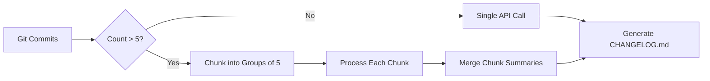

# Phase 5: Documentation Polish - Research

**Researched:** 2026-02-04
**Domain:** Technical documentation, community standards, architecture visualization
**Confidence:** HIGH

## Summary

Documentation polish for open source projects requires professional README restructuring, standardized community documentation (Code of Conduct), accurate security contact information, and visual architecture diagrams. The standard approach uses GitHub-native features (Mermaid diagrams), widely-adopted community standards (Contributor Covenant v2.1), and proven README patterns from successful open source projects.

The project already has substantial content (308-line README, existing SECURITY.md), making this phase primarily about reorganization and completing missing pieces rather than creating from scratch. The key challenges are maintaining working documentation while improving polish and ensuring the architecture diagram accurately represents the chunking/AI processing strategy.

**Primary recommendation:** Restructure README using proven GitHub Action patterns (badges, quick start, troubleshooting), add Contributor Covenant v2.1 CODE_OF_CONDUCT.md, replace SECURITY.md placeholder email, and create Mermaid flowchart showing chunking strategy and data flow.

## Standard Stack

### Core

| Tool | Version | Purpose | Why Standard |
|------|---------|---------|--------------|
| Mermaid | v11.1.0+ | Architecture diagrams in markdown | Native GitHub support, renders in all markdown files, no external images needed |
| Contributor Covenant | v2.1 | Code of Conduct template | Most widely adopted open source CoC (Linux kernel, 100k+ projects) |
| Shields.io | Latest | README badges | Industry standard for status badges, integrates with GitHub Actions |

### Supporting

| Tool | Version | Purpose | When to Use |
|------|---------|---------|-------------|
| Mermaid Live Editor | Web-based | Interactive diagram design | Testing complex diagrams before committing |
| GitHub Markdown Preview | Built-in | Visual verification | Checking formatting before commit |

### Alternatives Considered

| Instead of | Could Use | Tradeoff |
|------------|-----------|----------|
| Mermaid | PlantUML, Draw.io | Mermaid has native GitHub rendering, no external hosting needed |
| Contributor Covenant | Custom CoC | Contributor Covenant is recognized standard, reduces bikeshedding |
| Shields.io | Custom SVG badges | Shields.io auto-updates with CI status, no manual maintenance |

**Installation:**
```bash
# No installation needed - all tools are web-based or GitHub-native
# Mermaid syntax is embedded in markdown code blocks
# Badges are generated via URLs
```

## Architecture Patterns

### Recommended README Structure (GitHub Actions)

Based on analysis of successful GitHub Actions and 500+ trending repositories:

```
README.md
├── Badges                    # CI, version, license (top of file)
├── Title + One-line desc     # Clear, concise
├── Features                  # Bulleted list of key capabilities
├── Usage                     # Primary use case first
│   ├── Example Workflow      # Copy-paste ready
│   ├── Testing Configuration # Dry run example
│   └── Common Mistakes       # Antipatterns with ❌/✅
├── Prerequisites             # Setup steps before using
├── Action Inputs             # Table with all parameters
├── Troubleshooting          # Common issues with solutions
├── Architecture             # Link to diagram or embed
├── Security                 # Link to SECURITY.md
├── Contributing             # Link to CODE_OF_CONDUCT.md
└── License                  # License name + link
```

**Key principle:** Progressive disclosure - quick start first, details later. Users should be able to copy-paste a working example within 30 seconds.

### Pattern 1: README Badge Section

**What:** Status badges at top of README showing build status, coverage, version, license
**When to use:** All public repositories, especially GitHub Actions
**Example:**
```markdown
[](https://github.com/user/repo/actions/workflows/ci.yml)
[](https://opensource.org/licenses/MIT)
```

**Best practices:**
- Stick to 4-7 badges maximum (build, coverage, version, license + optionals)
- Link badges to their sources (clickable for details)
- Position at top for immediate visibility

**Source:** [daily.dev - README Badges Best Practices](https://daily.dev/blog/readme-badges-github-best-practices)

### Pattern 2: Troubleshooting Section Structure

**What:** Dedicated section addressing common issues with symptoms, causes, and solutions
**When to use:** Any project requiring installation or configuration
**Example:**
```markdown
## Troubleshooting

### Symptoms of Incomplete Changelog
- Summary appears cut off or incomplete
- Only seeing a few commits despite long time period

**Root Causes:**
1. Insufficient fetch depth
2. Repository has >500 commits/month

**Solutions:**
- Increase `fetch-depth` in checkout step
- Reduce `days_back` parameter
- Run changelog more frequently
```

**Best practices:**
- Use "Symptoms → Root Causes → Solutions" structure
- Include command examples and expected output
- Add "When to increase X" guidance with specific thresholds
- Link to relevant GitHub Actions logs or documentation

**Source:** [Tilburg Science Hub - README Best Practices](https://tilburgsciencehub.com/building-blocks/store-and-document-your-data/document-data/readme-best-practices/)

### Pattern 3: Mermaid Flowchart for CI/CD Pipelines

**What:** Inline Mermaid diagram showing data flow through GitHub Action steps
**When to use:** Complex workflows with multiple stages, chunking, or branching logic
**Example:**


**Best practices:**
- Use `flowchart LR` (left-to-right) for pipelines, `TD` (top-down) for hierarchies
- Label decision diamonds with clear yes/no or conditions
- Use subgraphs for grouping related steps
- Keep to 8-12 nodes for readability (split into multiple diagrams if needed)

**Source:** [GitHub Blog - Include diagrams in Markdown with Mermaid](https://github.blog/developer-skills/github/include-diagrams-markdown-files-mermaid/)

### Pattern 4: Contributor Covenant v2.1 Integration

**What:** Standard Code of Conduct from most widely adopted CoC (100k+ projects)
**When to use:** All public open source projects
**Example:**
```markdown
## Code of Conduct

This project follows the [Contributor Covenant v2.1](CODE_OF_CONDUCT.md).
We are committed to providing a welcoming and inclusive environment.
```

**File location:** `CODE_OF_CONDUCT.md` in repository root
**Customization points:**
- Replace `[INSERT CONTACT METHOD]` with actual email or reporting mechanism
- Optionally customize enforcement guidelines for project size

**Source:** [Contributor Covenant Official Site](https://www.contributor-covenant.org/version/2/1/code_of_conduct/)

### Anti-Patterns to Avoid

- **Walls of text:** Break paragraphs into bulleted lists for scanability
- **Buried quick start:** Don't make users scroll past feature lists to find usage
- **Stale badges:** Dead badges are worse than no badges (suggests abandoned project)
- **Placeholder content in production:** `TODO`, `[Your email here]`, `Coming soon` signals unprofessional
- **Missing troubleshooting:** Users will create duplicate issues for common problems
- **External diagram hosting:** Use inline Mermaid instead of PNG/SVG files that become outdated

## Don't Hand-Roll

Problems that look simple but have existing solutions:

| Problem | Don't Build | Use Instead | Why |
|---------|-------------|-------------|-----|
| Code of Conduct | Custom rules from scratch | Contributor Covenant v2.1 | Legally vetted, widely recognized, includes enforcement guidelines |
| Status badges | Manual SVG creation | Shields.io URLs | Auto-updates with CI status, standardized styling |
| Architecture diagrams | Draw.io/PowerPoint images | Mermaid markdown code blocks | Version-controlled, GitHub renders natively, updates with code |
| Security policy | Generic template | SECURITY.md with real contact | GitHub recognizes this file, shows in security tab |
| Installation docs | Prose paragraphs | Copy-paste code blocks | Users want to execute, not interpret |

**Key insight:** Documentation infrastructure is well-established. Innovation happens in explaining YOUR project, not reinventing documentation formats.

## Common Pitfalls

### Pitfall 1: README Becomes Reference Manual

**What goes wrong:** README grows to 1000+ lines covering every edge case, becomes overwhelming
**Why it happens:** Documentation written incrementally without refactoring structure
**How to avoid:**
- Keep README focused on getting started and common use cases
- Extract detailed guides to separate docs (ARCHITECTURE.md, TROUBLESHOOTING.md)
- Use links liberally to external documentation
- Follow "30-second to first working example" rule

**Warning signs:**
- Table of contents has >10 top-level sections
- Installation section >100 lines
- Multiple code examples for same feature

**Source:** [awesome-readme curated examples](https://github.com/matiassingers/awesome-readme)

### Pitfall 2: Placeholder Content in Production Files

**What goes wrong:** SECURITY.md has `[security@your-domain.com]`, CODE_OF_CONDUCT.md missing
**Why it happens:** Templates copied without customization, "good enough for now" mentality
**How to avoid:**
- Grep for placeholder patterns before tagging releases: `[TODO]`, `[INSERT`, `your-domain`
- Use CI pre-release checks to block merges with placeholders
- Treat documentation with same rigor as code (no TODOs in main branch)

**Warning signs:**
- Bracketed text like `[Your Name Here]` in committed files
- Generic email addresses (example.com, your-domain.com)
- Comments like "TODO: update before v1.0"

### Pitfall 3: Mermaid Diagram Complexity Overload

**What goes wrong:** Architecture diagram has 50+ nodes, impossible to read on GitHub
**Why it happens:** Trying to show entire system in single diagram
**How to avoid:**
- Use hierarchical diagrams (overview → detail views)
- Maximum 8-12 nodes per diagram for readability
- Use subgraphs to collapse related components
- Create separate diagrams for different flows (happy path, error handling, extended mode)

**Warning signs:**
- Diagram requires horizontal scrolling on laptop screen
- Node labels overlap or become unreadable
- Unable to distinguish flow direction

**Source:** [Mermaid Flowchart Documentation](https://mermaid.ai/open-source/syntax/flowchart.html)

### Pitfall 4: Troubleshooting Section as FAQ Dump

**What goes wrong:** Troubleshooting becomes unstructured Q&A list without actionable solutions
**Why it happens:** Questions added incrementally from issues without organizing
**How to avoid:**
- Group by symptom category (installation errors, API errors, output issues)
- Use consistent structure: Symptoms → Root Cause → Solution → Verification
- Include commands to verify the fix worked
- Link to relevant logs or configuration files

**Warning signs:**
- No search/navigation structure (just numbered list)
- Answers like "check your configuration" without specifics
- Missing verification steps ("how do I know it's fixed?")

## Code Examples

Verified patterns from official sources:

### Mermaid Flowchart for Chunking Strategy

```markdown
## Architecture

The action uses intelligent chunking to handle large commit sets:

\`\`\`mermaid
flowchart TD
    A[Git Commits Collected] --> B{Commit Count}
    B -->|<= 5 commits| C[Single API Call]
    B -->|> 5 commits| D[Chunk into Groups of 5]

    C --> E[Generate Technical Summary]
    C --> F[Generate Business Summary]

    D --> G[Process Chunk 1]
    D --> H[Process Chunk 2]
    D --> I[Process Chunk N]

    G --> J[Chunk Summaries]
    H --> J
    I --> J

    J --> K[Merge API Call]
    K --> E
    K --> F

    E --> L[Format CHANGELOG.md]
    F --> L
    L --> M[Commit to Repo]
\`\`\`

See [ARCHITECTURE.md](.planning/codebase/ARCHITECTURE.md) for detailed flow.
```

**Source:** [GitHub Docs - Creating Diagrams](https://docs.github.com/en/get-started/writing-on-github/working-with-advanced-formatting/creating-diagrams)

### README Badge Section

```markdown
[](https://github.com/user/repo/actions/workflows/ci.yml)
[](https://opensource.org/licenses/MIT)

# Project Name

One-line description explaining what this does and why someone would use it.
```

**Source:** [Shields.io Badge Documentation](https://shields.io/)

### Troubleshooting Template

```markdown
## Troubleshooting

### Issue: Changelog appears incomplete

**Symptoms:**
- Summary cut off mid-sentence
- Fewer commits than expected in period
- Missing recent features in technical summary

**Root Causes:**
1. **Insufficient git fetch depth** - Default 50 commits may not cover full period
2. **High commit volume** - Repository has >500 commits/month

**Solutions:**

Increase fetch depth in your workflow:
\`\`\`yaml
- name: Checkout repository
  uses: actions/checkout@v4
  with:
    fetch-depth: 1000  # Increase from default
\`\`\`

**Verify fix:** Check GitHub Actions logs for "Commits processed: X" - should match `git log --since="X days ago" --oneline | wc -l`
```

### CODE_OF_CONDUCT.md Template

```markdown
# Contributor Covenant Code of Conduct

## Our Pledge

We as members, contributors, and leaders pledge to make participation in our
community a harassment-free experience for everyone, regardless of age, body
size, visible or invisible disability, ethnicity, sex characteristics, gender
identity and expression, level of experience, education, socio-economic status,
nationality, personal appearance, race, caste, color, religion, or sexual
identity and orientation.

## Our Standards

Examples of behavior that contributes to a positive environment:
- Demonstrating empathy and kindness toward others
- Respecting differing opinions, viewpoints, and experiences
- Giving and gracefully accepting constructive feedback
- Accepting responsibility and apologizing to those affected by our mistakes

Examples of unacceptable behavior:
- Sexualized language or imagery, and sexual attention of any kind
- Trolling, insulting comments, and personal or political attacks
- Public or private harassment
- Publishing others' private information without explicit permission

## Enforcement

Instances of abusive, harassing, or otherwise unacceptable behavior may be
reported to [INSERT CONTACT EMAIL].

All complaints will be reviewed and investigated promptly and fairly.

## Attribution

This Code of Conduct is adapted from the [Contributor Covenant][homepage],
version 2.1, available at
https://www.contributor-covenant.org/version/2/1/code_of_conduct.html

[homepage]: https://www.contributor-covenant.org
```

**Source:** [Contributor Covenant v2.1](https://www.contributor-covenant.org/version/2/1/code_of_conduct/)

## State of the Art

| Old Approach | Current Approach | When Changed | Impact |
|--------------|------------------|--------------|--------|
| External diagram images (PNG/SVG in repo) | Mermaid code blocks | 2022 (GitHub native support) | Diagrams version-controlled as text, render in-line |
| Custom badge generation | Shields.io URLs | 2018+ (widespread adoption) | Auto-updating badges, no manual SVG creation |
| Custom Code of Conduct | Contributor Covenant | 2019+ (industry standard) | Reduced bikeshedding, legal clarity |
| Separate documentation site | Rich README + links | 2020+ (GitHub features) | Lower barrier to documentation updates |
| Architecture in external wiki | ARCHITECTURE.md in repo | 2021+ (docs-as-code) | Version-controlled with code it describes |

**Deprecated/outdated:**
- **Travis CI badges:** GitHub Actions native badges are standard for GitHub-hosted projects
- **Contributor Covenant v1.4:** v2.1 released with improved enforcement guidelines and scope clarity
- **Image-based diagrams without source:** Mermaid provides text-to-diagram with GitHub rendering
- **Gitter/Slack badges:** Discord/GitHub Discussions more common for project communication

## Open Questions

Things that couldn't be fully resolved:

1. **What should the real security contact email be?**
   - What we know: SECURITY.md has placeholder `[security@your-domain.com]`
   - What's unclear: Whether to use personal email, create project-specific email, or use GitHub Security Advisories only
   - Recommendation: Use GitHub Security Advisories URL as primary (no email needed) since it's built-in and private

2. **How detailed should the architecture diagram be?**
   - What we know: ARCHITECTURE.md has comprehensive text description of chunking strategy
   - What's unclear: Whether to show high-level flow (10 nodes) or detailed flow with retry logic (30+ nodes)
   - Recommendation: Create two diagrams - high-level overview in README (8-10 nodes), detailed flow in ARCHITECTURE.md (reference from README)

3. **Should README link to ARCHITECTURE.md or embed diagram inline?**
   - What we know: Current README is 308 lines, adding diagram would make it longer
   - What's unclear: Whether users want architecture in README or separate doc
   - Recommendation: Small overview diagram in README with link to ARCHITECTURE.md for details (progressive disclosure pattern)

## Sources

### Primary (HIGH confidence)

- [Contributor Covenant v2.1](https://www.contributor-covenant.org/version/2/1/code_of_conduct/) - Official CoC template
- [GitHub Docs - Creating Diagrams](https://docs.github.com/en/get-started/writing-on-github/working-with-advanced-formatting/creating-diagrams) - Native Mermaid support documentation
- [Mermaid Flowchart Syntax](https://mermaid.ai/open-source/syntax/flowchart.html) - Official syntax reference
- [GitHub Blog - Mermaid Support](https://github.blog/developer-skills/github/include-diagrams-markdown-files-mermaid/) - Feature announcement and usage

### Secondary (MEDIUM confidence)

- [awesome-readme](https://github.com/matiassingers/awesome-readme) - Curated examples of professional READMEs
- [River Editor - GitHub README Template](https://rivereditor.com/blogs/write-perfect-readme-github-repo) - Analysis of 500+ trending repositories
- [daily.dev - README Badges Best Practices](https://daily.dev/blog/readme-badges-github-best-practices) - Badge positioning and selection
- [Tilburg Science Hub - README Best Practices](https://tilburgsciencehub.com/building-blocks/store-and-document-your-data/document-data/readme-best-practices/) - Academic perspective on documentation

### Tertiary (LOW confidence)

- [GitHub Gist - Mermaid CI/CD Examples](https://gist.github.com/GingerGraham/66a1e586fe2addbc6375b1fba1d2818c) - Community examples, not official
- Various blog posts on README structure - Aggregated patterns but not authoritative sources

## Metadata

**Confidence breakdown:**
- Standard stack: HIGH - Mermaid, Contributor Covenant, Shields.io are industry standards with official documentation
- Architecture patterns: HIGH - Patterns verified from GitHub official docs, Contributor Covenant site, Mermaid docs
- Pitfalls: MEDIUM - Based on community resources and curated examples, not empirical research

**Research date:** 2026-02-04
**Valid until:** 2026-04-04 (60 days - documentation standards stable, Mermaid syntax may add features)

**Key constraints from project:**
- README already has 308 lines of good content - reorganize, don't rewrite
- SECURITY.md exists with placeholder email - replace only the contact method
- CODE_OF_CONDUCT.md does NOT exist - create from scratch using v2.1 template
- No architecture diagram exists - create new Mermaid flowchart showing chunking strategy
- This is FINAL phase before v1 completion - polish quality matters for portfolio presentation
