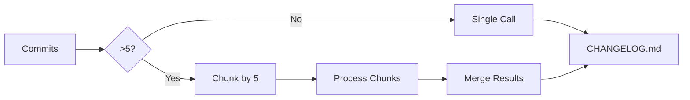

[](https://github.com/fridzema/ai-weekly-changelog-action/actions/workflows/ci.yml)
[](https://opensource.org/licenses/MIT)

# Weekly Changelog Action

This GitHub Action automatically generates a weekly changelog from your repository's recent commits using an AI model via [OpenRouter](https://openrouter.ai). It summarizes technical changes and their business impact, then commits the update to a `CHANGELOG.md` file.

## Features

-   **AI-Powered Summaries:** Generates separate technical and user-facing summaries.
-   **Multi-Language Support:** Outputs changelogs in English, Dutch, German, French, or Spanish.
-   **Customizable:** Control the look-back period, AI model, and more.
-   **Extended Analysis:** Optionally perform a deeper analysis of file changes and statistics.
-   **Automatic Commits:** Commits the updated `CHANGELOG.md` file back to your repository.

## Quick Start

Copy one of these example files to your repository:
- [Simple Example](.github/workflows/example-simple.yml) - Automatic weekly runs only
- [Full Example](.github/workflows/example-full.yml) - All parameters with manual controls

Create a workflow file in your repository at `.github/workflows/changelog.yml`:

```yaml
name: Generate Weekly Changelog

on:
  schedule:
    - cron: '0 6 * * MON' # Every Monday at 06:00 UTC
  workflow_dispatch: # Allows manual trigger

jobs:
  changelog:
    runs-on: ubuntu-latest
    permissions:
      contents: write # Required for committing the changelog

    steps:
      - name: Generate Weekly Changelog
        uses: fridzema/ai-weekly-changelog-action@main  # or @v1, @latest
        with:
          openrouter_api_key: ${{ secrets.OPENROUTER_API_KEY }}
          # Optional: customize behavior
          # days_back: 7
          # model: 'openai/gpt-5-mini'
          # language: 'English'
          # extended: false
          # force: false
```

**Important Notes**:
- ✅ **DO NOT** add a separate checkout step - the action handles this internally
- ✅ **DO NOT** pass `github_token` - the action uses it automatically from GitHub context
- ✅ **DO** set `permissions: contents: write` in your job
- ✅ **DO** add your OpenRouter API key to repository secrets

### Prerequisites

1.  **Add OpenRouter API Key to Secrets:**
    *   In your repository, go to `Settings` > `Secrets and variables` > `Actions`.
    *   Click `New repository secret`.
    *   Name the secret `OPENROUTER_API_KEY`.
    *   Paste your OpenRouter API key as the value.

## Usage Examples

### Simple Usage (Scheduled Weekly)

This workflow runs every Monday at 06:00 UTC and can also be triggered manually.

```yaml
# .github/workflows/changelog.yml
name: Weekly Changelog

on:
  schedule:
    - cron: '0 6 * * MON' # Every Monday at 06:00 UTC
  workflow_dispatch:
    inputs:
      force:
        description: 'Force update even if week entry already exists'
        type: boolean
        default: false

jobs:
  create_changelog:
    runs-on: ubuntu-latest

    # IMPORTANT: This permission is required to commit the changelog file
    permissions:
      contents: write

    steps:
      - name: Generate Weekly Changelog
        uses: fridzema/ai-weekly-changelog-action@main  # or @v1
        with:
          # Required: Your OpenRouter API key
          openrouter_api_key: ${{ secrets.OPENROUTER_API_KEY }}

          # Optional inputs with their defaults:
          # days_back: 7
          # model: 'openai/gpt-5-mini'
          # language: 'English'
          # extended: false
          force: ${{ github.event.inputs.force || false }}
```

### Advanced Usage (Full Manual Control)

Complete example with all available parameters exposed for manual testing:

```yaml
name: Generate Weekly Changelog

on:
  schedule:
    - cron: '0 6 * * MON' # Every Monday at 06:00 UTC
  workflow_dispatch:
    inputs:
      days_back:
        description: 'Number of days to look back for commits (1-365)'
        type: choice
        required: false
        default: '7'
        options:
          - '1'
          - '7'
          - '14'
          - '30'
          - '60'
          - '90'
      model:
        description: 'OpenRouter AI model to use'
        type: choice
        required: false
        default: 'openai/gpt-5-mini'
        options:
          - 'openai/gpt-5-mini'
          - 'openai/gpt-4o-mini'
          - 'anthropic/claude-3-haiku'
          - 'anthropic/claude-3-5-sonnet'
          - 'google/gemini-flash-1.5'
      language:
        description: 'Output language for the changelog'
        type: choice
        required: false
        default: 'English'
        options:
          - 'English'
          - 'Dutch'
          - 'German'
          - 'French'
          - 'Spanish'
      extended:
        description: 'Enable extended analysis (file changes, statistics)'
        type: boolean
        required: false
        default: false
      force:
        description: 'Force update existing week entry'
        type: boolean
        required: false
        default: false
      dry_run:
        description: 'Preview without committing (test mode)'
        type: boolean
        required: false
        default: false

jobs:
  changelog:
    runs-on: ubuntu-latest
    permissions:
      contents: write # Required for committing changelog
      # Note: For dry_run only, you can use: contents: read

    steps:
      - name: Generate Weekly Changelog
        uses: fridzema/ai-weekly-changelog-action@main
        with:
          # Required
          openrouter_api_key: ${{ secrets.OPENROUTER_API_KEY }}

          # Optional - All parameters with fallbacks
          days_back: ${{ inputs.days_back || '7' }}
          model: ${{ inputs.model || 'openai/gpt-5-mini' }}
          language: ${{ inputs.language || 'English' }}
          extended: ${{ inputs.extended || false }}
          force: ${{ inputs.force || false }}
          dry_run: ${{ inputs.dry_run || false }}
```

**How to use**:
1. Copy this file to `.github/workflows/changelog.yml` in your repository
2. Add `OPENROUTER_API_KEY` to your repository secrets
3. Go to **Actions** tab → **Generate Weekly Changelog** → **Run workflow**
4. Select your desired options from the dropdowns
5. Click **Run workflow**

**Testing workflow**:
- Start with `dry_run: true` to preview without committing
- Try different models to see which produces better output
- Use `extended: true` for detailed statistics and file changes
- Use `force: true` to regenerate an existing week's entry

### Testing Configuration (Dry Run)

To test your configuration without committing changes to the repository:

```yaml
# .github/workflows/test-changelog.yml
name: Test Changelog Generation

on:
  workflow_dispatch:

jobs:
  test_changelog:
    runs-on: ubuntu-latest
    permissions:
      contents: read  # Only read permission needed for dry run

    steps:
      - name: Test Changelog Generation
        uses: fridzema/ai-weekly-changelog-action@main
        with:
          openrouter_api_key: ${{ secrets.OPENROUTER_API_KEY }}
          dry_run: true  # Generate changelog without committing
          days_back: 7
          language: 'English'
```

When `dry_run` is enabled:
- The changelog is generated normally using AI
- The output is displayed in the GitHub Actions step summary (first 100 lines)
- No commit is made to the repository
- Perfect for testing configuration changes or different models

### Common Mistakes to Avoid

❌ **Don't do this** (redundant checkout):
```yaml
steps:
  - uses: actions/checkout@v4  # ← NOT NEEDED - Action does this internally
  - uses: fridzema/ai-weekly-changelog-action@main
    with:
      openrouter_api_key: ${{ secrets.OPENROUTER_API_KEY }}
```

❌ **Don't pass github_token** (deprecated, causes warnings):
```yaml
- uses: fridzema/ai-weekly-changelog-action@main
  with:
    openrouter_api_key: ${{ secrets.OPENROUTER_API_KEY }}
    github_token: ${{ secrets.GITHUB_TOKEN }}  # ← NOT NEEDED - Causes warnings
```

✅ **Do this** (clean and simple):
```yaml
steps:
  - uses: fridzema/ai-weekly-changelog-action@main
    with:
      openrouter_api_key: ${{ secrets.OPENROUTER_API_KEY }}
```

### Version Pinning

For production use, pin to a specific version instead of `@main`:

```yaml
uses: fridzema/ai-weekly-changelog-action@v1.0.0  # Pin to specific release
# or
uses: fridzema/ai-weekly-changelog-action@v1      # Pin to major version
```

Check the [releases page](https://github.com/fridzema/ai-weekly-changelog-action/releases) for available versions.

## Action Inputs

| Input                | Description                                                                  | Required | Default                    |
| -------------------- | ---------------------------------------------------------------------------- | -------- | -------------------------- |
| `openrouter_api_key` | API key for OpenRouter.ai.                                                   | `true`   | `N/A`                      |
| `github_token`       | GitHub token for checking out code and committing changes.                   | `true`   | `${{ github.token }}`      |
| `days_back`          | Number of days to look back for commits (1-365).                             | `false`  | `7`                        |
| `model`              | The OpenRouter model to use (e.g., `openai/gpt-5-mini`).                    | `false`  | `openai/gpt-5-mini`       |
| `language`           | Output language. Options: `English`, `Dutch`, `German`, `French`, `Spanish`. | `false`  | `English`                  |
| `force`              | Force update even if an entry for the current week already exists.           | `false`  | `false`                    |
| `extended`           | Enable extended analysis with file changes and deeper commit inspection.     | `false`  | `false`                    |
| `dry_run`            | Generate changelog without committing (outputs to step summary instead).     | `false`  | `false`                    |

## Troubleshooting

This section helps diagnose and resolve common issues when generating changelogs.

### Symptoms of Incomplete Changelog

If your generated changelog seems incomplete, look for these indicators:

- Summary appears cut off or incomplete
- Only seeing a few commits despite long time period (e.g., 30 days)
- Mismatch between summary content and "All Commits" list
- Missing recent features or changes in the technical/business summaries

### Root Causes

#### 1. Insufficient Git Fetch Depth (Fixed in Current Version)

The action now uses dynamic fetch depths based on the lookback period:
- 7 days: 100 commits
- 30 days: 300 commits
- 90+ days: 500 commits

**If you're using an older version**, you may need to increase the fetch depth manually:

```yaml
- name: Checkout repository
  uses: actions/checkout@v4
  with:
    fetch-depth: 500  # Increase if needed for very active repositories
```

#### 2. Very High Commit Volume (>500 commits in period)

For extremely active repositories:

**Solution 1: Reduce lookback period**
```yaml
days_back: 14  # Instead of 30
```

**Solution 2: Run changelog more frequently**
```yaml
on:
  schedule:
    - cron: '0 6 * * MON,THU'  # Twice per week instead of once
```

### Verification Steps

**1. Check GitHub Actions logs** for chunking indicators:
```
📊 Large commit set detected (30 commits)
🔄 Will analyze in 6 chunks of ~5 commits each for detailed analysis
💡 This approach ensures each commit gets focused attention
✅ Chunk 1/6 technical summary completed
✅ Chunk 1/6 business summary completed
...
🔄 Merging 6 technical chunk summaries...
🔄 Merging 6 business chunk summaries...
```

**2. Check CHANGELOG.md** for the chunking note:
```markdown
> 📊 **Note**: This changelog was generated by analyzing 30 commits across 6 detailed chunks for comprehensive, high-quality coverage.
```

**3. Validate commit count** matches expectations:
- Look at GitHub Actions step summary: "Commits processed: X"
- Compare with: `git log --since="30 days ago" --oneline | wc -l`

### Authentication Issues

**Error: `401 Unauthorized` or `403 Forbidden`**

**Cause:** Invalid or missing OpenRouter API key.

**Solution:**
1. Verify the secret exists: Settings > Secrets and variables > Actions
2. Check the secret name is exactly `OPENROUTER_API_KEY`
3. Verify the API key format starts with `sk-or-`
4. Test the key: https://openrouter.ai/docs/api-keys

### Model Availability Issues

**Error: `404 Model Not Found`**

**Cause:** Selected model is not available or name is incorrect.

**Solution:**
1. Check available models: https://openrouter.ai/models
2. Use a common stable model:
   - `openai/gpt-5-mini` (recommended, fast and cost-effective)
   - `openai/gpt-4o-mini` (more capable)
   - `anthropic/claude-3-haiku` (fast)
   - `anthropic/claude-3-5-sonnet` (highest quality)

### Rate Limiting

**Error: `429 Too Many Requests`**

**Cause:** API rate limit exceeded.

**Solutions:**
1. Wait a few minutes and retry
2. Reduce commit volume:
   ```yaml
   days_back: 7  # Instead of 30
   ```
3. Check OpenRouter dashboard for rate limit details
4. Consider upgrading OpenRouter plan for higher limits

### Cost Considerations

The action uses **micro-chunking** (5 commits per chunk) for high-quality summaries. This means:

**API Call Volume:**
- 30 commits: ~14 API calls (6 chunks × 2 summaries + 2 merges)
- 150 commits: ~62 API calls (30 chunks × 2 summaries + 2 merges)

**Estimated Costs (GPT-5-mini):**
- 30 commits: $0.05-0.15 per changelog
- 150 commits: $0.20-0.80 per changelog
- 300 commits: $0.40-1.50 per changelog

**Cost Optimization Tips:**
- Use smaller `days_back` values (7 instead of 30)
- Run weekly instead of monthly
- Use `openai/gpt-5-mini` (most cost-effective)

## Architecture

This action uses intelligent micro-chunking to ensure high-quality summaries:



**Key Features:**
- **Micro-chunking**: Splits large commit sets into groups of 5 for focused AI analysis
- **Parallel processing**: Each chunk gets separate technical and business summaries
- **Hierarchical merging**: Chunk summaries are merged intelligently to create cohesive final output
- **Quality over cost**: More API calls but significantly better summary quality

See [Architecture Documentation](docs/ARCHITECTURE.md) for detailed diagrams and technical explanation.

## Security

See [SECURITY.md](SECURITY.md) for our security policy and how to report vulnerabilities.

**Key Security Features:**
- API key redaction in logs and error messages
- No full keys logged to console or files
- Format validation for OpenRouter API keys
- Secure secret management via GitHub Actions secrets

## Contributing

This project follows the [Contributor Covenant Code of Conduct](CODE_OF_CONDUCT.md).

Contributions are welcome! Please:
1. Fork the repository
2. Create a feature branch
3. Make your changes
4. Test with `dry_run: true`
5. Submit a pull request

## License

[MIT License](LICENSE)
