# Architecture Documentation

This document provides a comprehensive overview of the AI Weekly Changelog Action's architecture, including data flows, processing strategies, and key design decisions.

## Overview

The AI Weekly Changelog Action is a GitHub Action that automatically generates high-quality weekly changelogs from repository commits using AI models via OpenRouter. The system employs a **micro-chunking strategy** to ensure detailed analysis of large commit sets, splitting commits into small groups of 5 for focused AI analysis before merging into comprehensive summaries.

**Key Design Principles:**
- **Quality over cost**: Prioritizes summary quality through detailed micro-chunking (5 commits per chunk)
- **Comprehensive coverage**: Analyzes ALL commits, not just a subset
- **Graceful degradation**: Continues processing even if individual chunks fail
- **Multi-language support**: Generates changelogs in 5 languages with localized formatting

## High-Level Processing Flow

The action follows a sequential pipeline from input validation to changelog commit:


## Micro-Chunking Strategy

The core innovation of this action is the micro-chunking approach that ensures comprehensive, high-quality analysis regardless of commit volume:


**Key Constants:**
- `COMMITS_PER_CHUNK = 5`: Maximum commits per chunk for focused analysis
- Each chunk receives **separate technical and business analysis**
- Chunk summaries are **merged hierarchically** to avoid API payload limits
- **2 API calls per chunk** (technical + business) + merge operations

**Example Scaling:**
- 30 commits = 6 chunks × 2 summaries = 12 chunk calls + 2 merge calls = **14 total API calls**
- 150 commits = 30 chunks × 2 summaries = 60 chunk calls + 2 merge calls = **62 total API calls**

## Data Flow Architecture

This diagram shows how data transforms through each stage of the pipeline:

```mermaid
flowchart LR
    A[Git Repository] -->|git log command| B[Raw Commit Data]
    B -->|Parse format:<br/>hash\|subject\|author\|date\|short_hash| C[Commit Objects]

    C --> D{Extended Mode?}
    D -->|Yes| E[File Statistics<br/>lines added/deleted<br/>files changed]
    D -->|No| F[Chunker Logic]
    E --> F

    F -->|Split into groups of 5| G[Commit Chunks]

    G --> H1[Chunk 1]
    G --> H2[Chunk 2]
    G --> H3[Chunk n]

    H1 --> I1[OpenRouter API<br/>Tech + Business]
    H2 --> I2[OpenRouter API<br/>Tech + Business]
    H3 --> I3[OpenRouter API<br/>Tech + Business]

    I1 -->|With retry logic| J1[Summary Pair 1]
    I2 -->|With retry logic| J2[Summary Pair 2]
    I3 -->|With retry logic| J3[Summary Pair n]

    J1 & J2 & J3 --> K[Hierarchical Merger]
    K --> L[Final Summaries<br/>Technical + Business]

    L --> M[Changelog Formatter]
    C --> M

    M -->|Week-based organization| N[CHANGELOG.md Entry]
    N --> O[Git Commit]

    style D fill:#ffe6cc
    style F fill:#cce6ff
    style K fill:#e6ffe6
```

## Extended Analysis Mode

When `extended: true` is enabled, the action collects additional file statistics for deeper analysis:


**Token Allocation for Extended Mode:**
- Standard mode: **3000 tokens** per summary
- Large commit sets (>100): **5000 tokens** per summary
- Extended analysis: **6000 tokens** per summary
- Merge operations: **6000 tokens** for combining summaries

**Safety Measures:**
- File changes data truncated to **5000 characters** max to prevent oversized prompts
- Prompt size validation before API calls (fail fast on >120K tokens)
- Graceful truncation with clear indicators in output

## Error Handling & Retry Strategy

The action implements comprehensive error handling with exponential backoff and specific handling for different error types:

```mermaid
flowchart TD
    A[API Call Attempt] --> B{Success?}
    B -->|Yes| C[Return Result]
    B -->|No| D[Check Error Type]

    D --> E{Error Type?}

    E -->|401/Unauthorized| F[Authentication Error]
    F --> G[Print API Key Help]
    G --> H[Exit: Auth Failed]

    E -->|404/Model Not Found| I[Model Availability Error]
    I --> J[Print Model Suggestions]
    J --> K[Exit: Model Error]

    E -->|429/Rate Limit| L[Rate Limiting Detected]
    L --> M{Retry Count < 3?}
    M -->|Yes| N[Wait: delay × 3^attempt<br/>+ jitter 1-5s]
    M -->|No| O[Exit: Rate Limit Exceeded]
    N --> A

    E -->|413/Payload Too Large| P[Payload Size Error]
    P --> Q[Hierarchical Merge Strategy]
    Q --> R[Reduce Batch Size]
    R --> A

    E -->|Timeout/Network| S[Network Error]
    S --> T{Retry Count < 3?}
    T -->|Yes| U[Wait: delay × 2^attempt<br/>+ jitter 0.5-2s]
    T -->|No| V[Exit: Network Failed]
    U --> A

    E -->|Other Error| W{Retry Count < 3?}
    W -->|Yes| X[Wait: delay × 2^attempt<br/>+ jitter 0.1-1s]
    W -->|No| Y[Fallback Summary]
    X --> A
    Y --> Z[Continue with Fallback]

    style E fill:#ffe6cc
    style M fill:#cce6ff
    style T fill:#cce6ff
    style W fill:#cce6ff
    style Q fill:#e6ffe6
```



**Retry Configuration:**
- **Max attempts**: 3 retries per API call
- **Base delay**: 2 seconds
- **Timeout**: 30 seconds per request
- **Exponential backoff**: `delay × 2^attempt` for standard errors
- **Rate limit backoff**: `delay × 3^attempt` for 429 errors (longer wait)
- **Jitter**: Random 0.1-5s added to prevent thundering herd

**Error-Specific Handling:**
- **401 (Auth)**: Immediate exit with API key setup instructions
- **404 (Model)**: Immediate exit with model availability guidance
- **429 (Rate Limit)**: Longer backoff (3× instead of 2×) with helpful messages
- **413 (Payload)**: Trigger hierarchical merge with smaller batches
- **Timeout/Network**: Standard retry with network troubleshooting tips
- **Other Errors**: Fallback to generic summary after max retries

## Hierarchical Merge Strategy

To handle very large commit sets and avoid 413 (Payload Too Large) errors, the system implements hierarchical merging:


**Adaptive Batching:**
- Default batch size: **5 summaries per merge**
- If merge fails with 413 error: **Reduce batch size by 1** and retry
- Recursive merging continues until single summary produced
- Safety limit: Minimum batch size of **2** to ensure progress

## Multi-Language Support

The action supports 5 languages with complete localization:


**Supported Languages:**
- **English**: Default, `MM-DD-YYYY` date format
- **Dutch**: `DD-MM-YYYY` format
- **German**: `DD.MM.YYYY` format
- **French**: `DD/MM/YYYY` format
- **Spanish**: `DD/MM/YYYY` format

**Localized Elements:**
- Week labels, date formats, commit counts
- Section headers (Technical Changes, User Impact, Statistics, etc.)
- Statistical terminology (lines added/deleted, files changed)
- Fallback messages when AI generation fails
- Force update indicators

## Performance Characteristics

**Processing Time:**
- Small sets (≤5 commits): ~5-10 seconds (single analysis)
- Medium sets (30 commits): ~30-60 seconds (6 chunks + merges)
- Large sets (150 commits): ~2-4 minutes (30 chunks + hierarchical merges)

**API Call Volume:**
- Direct formula: `(commits / 5) × 2 + merge_calls`
- Small sets: **2 calls** (technical + business)
- 30 commits: **~14 calls** (12 chunk + 2 merge)
- 150 commits: **~62 calls** (60 chunk + 2 merge)

**Memory Efficiency:**
- Commits processed in batches of 50 for parsing
- Progress indicators for sets >200 commits
- Temporary file cleanup after processing
- Extended data truncation to prevent memory bloat

## Security & API Key Management

**API Key Redaction:**
- Exact match redaction of full API key from all error messages
- Regex pattern matching for `sk-or-*` format
- Shows first 4 characters for debugging (e.g., `sk-or-...[REDACTED]`)
- Applied to all exception handling and logging

**Validation:**
- Checks for `OPENROUTER_API_KEY` environment variable
- Validates format (should start with `sk-or-`)
- Provides setup instructions if missing or invalid
- Never logs full API key to console or files

## Changelog Management

**Week-Based Organization:**
- Uses ISO week numbers for consistent grouping
- Format: `Week {number}, {year}`
- Entries sorted newest first
- Automatic duplicate detection

**Force Update Mode:**
- `force: true` allows overwriting existing week entries
- Removes old entry before inserting new one
- Adds `(Force Updated)` indicator to header
- Preserves other changelog sections

**Structure:**
```
# Changelog

This file is automatically updated with weekly changes.

## Week 6, 2026 (Force Updated)

*Generated on 02-06-2026 - 30 commits*

> 📊 **Note**: This changelog was generated by analyzing 30 commits across 6 detailed chunks...

### 🔧 Technical Changes
[AI-generated technical summary with markdown formatting]

### 📈 User Impact
[AI-generated business summary with markdown formatting]

### 📊 Statistics (Extended mode only)
- **150** lines added
- **42** lines deleted
- **12** files changed

### 📋 All Commits
- [abc123] Fix authentication bug - John Doe
- [def456] Add user dashboard - Jane Smith
...

---
```

## Related Documentation

- **[../README.md](../README.md)**: Usage instructions and examples
- **[../CLAUDE.md](../CLAUDE.md)**: Development guide and troubleshooting
- **[../src/generate_changelog.py](../src/generate_changelog.py)**: Implementation source code
